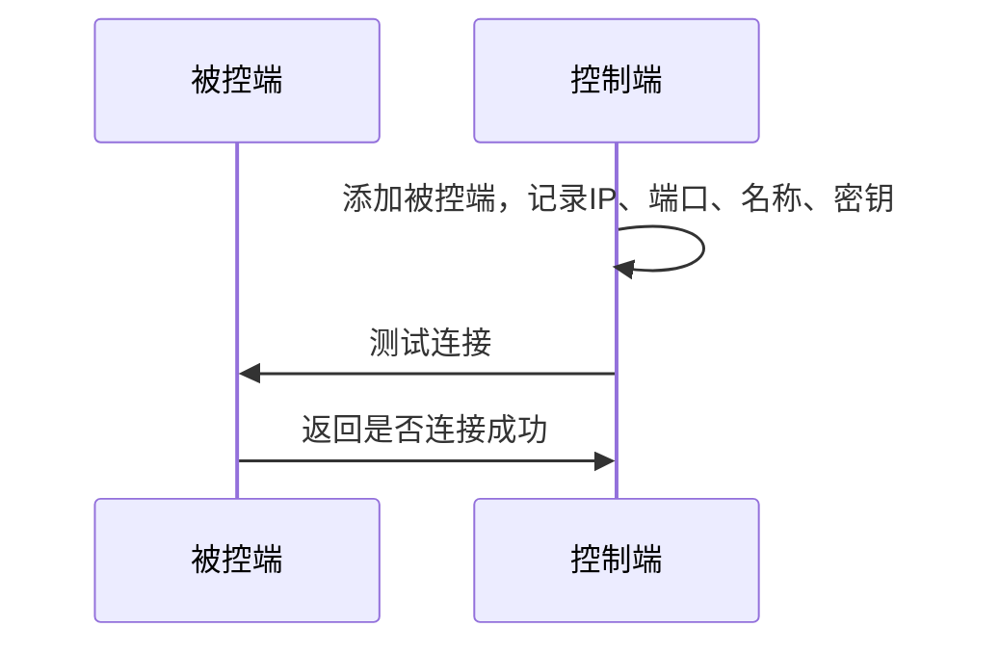
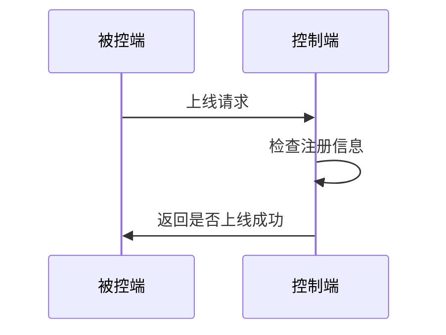
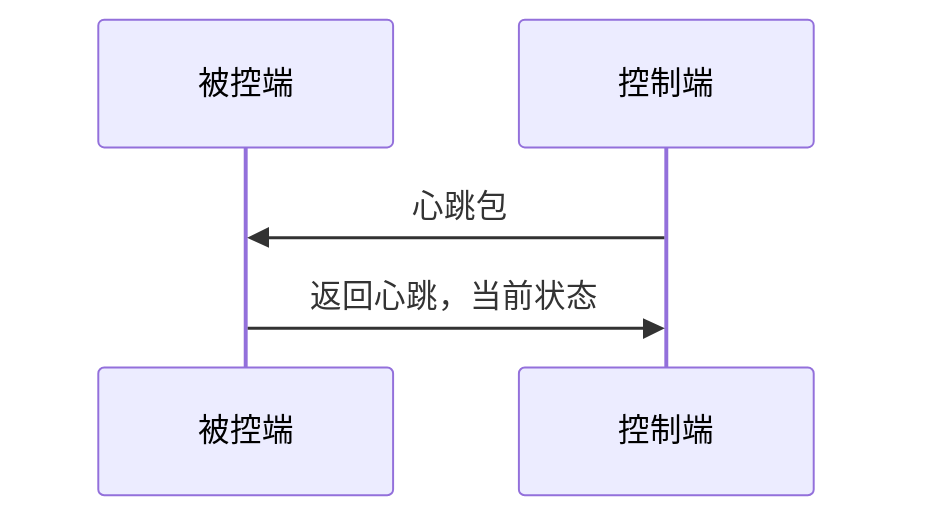
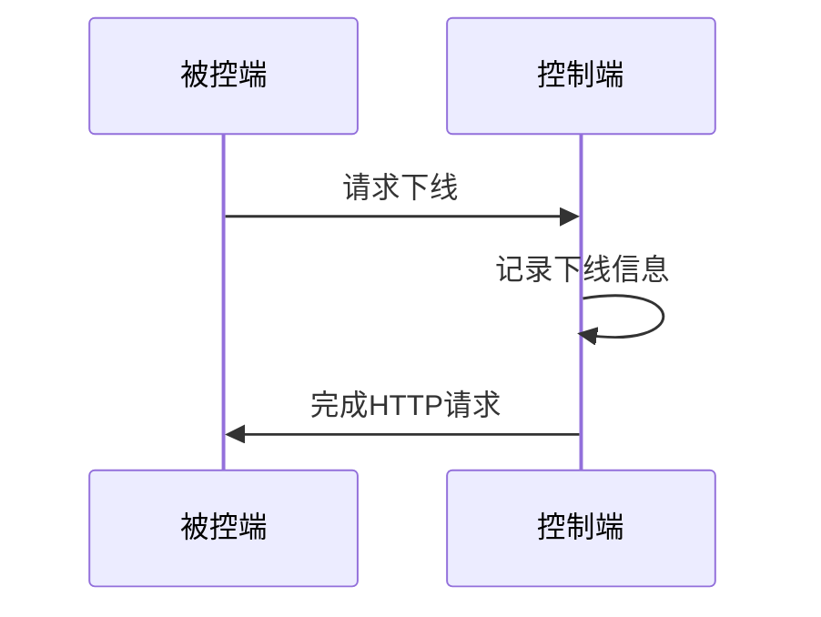
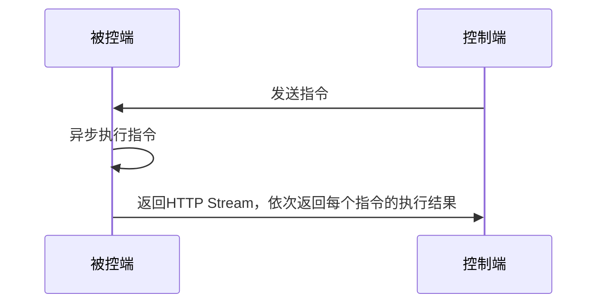

# 平台框架设计

使用HTTP协议，实现两个端之间的连接和控制。

## 被控端

Python侧，用于实际命令的执行。

使用Flask来架设一个HTTP服务，接收控制端发来的命令。

### 实现的功能

- 第一次启动随机生成一段uuid，作为密钥，处理请求时需要在请求头中验证密钥
- 按照顺序执行命令（包含LED、摄像头、机械臂、GPIO、泵）
- 指令按HTTP Stream返回，前端可以实时显示

## 控制端

Java侧，用于管理一个或多个被控端。

### 实现的功能

- 添加、删除、修改被控端
- 对多个被控端进行统一控制
- 编辑并保存快捷指令，作为一个命令组，可以在任意地方被引用
- 发送指令到被控端
- 使用大语言模型来生成指令，可以使用麦克风语音输入（前端调用麦克风，将音频给Java来调用第三方库识别）
- 使用类似Scratch或者虚幻引擎蓝图的可视化工具在前端编辑指令
- 管理定时任务，根据crontab执行，执行一个命令组
- （？）支持多用户，每个被控端的创建者可以分享被控端的操作权限给其他用户

# 流程图

## 注册被控端

用户在控制端中添加一个被控端。

## 被控端上线

适用于已经注册的被控端，在上线的时候主动通知控制端。

## 心跳包

每10s检测一次，如果超过一定时间没有收到心跳包，则认为被控端掉线。

## 被控端下线

被控端主动下线，向控制端发送下线请求。

## 执行指令

